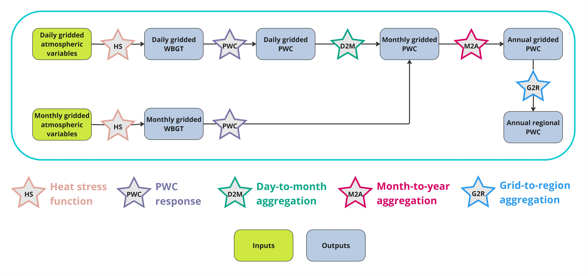

# Summary

Labor productivity, especially in outdoor sectors like primary agriculture, is highly sensitive to weather variations and heat stress. Understanding how labor productivity responds to key heat stress factors, such as temperature and humidity, is essential for evaluating future climate scenarios and their multisectoral dynamic (MSD) impacts. However, global economic and MSD modeling often operate at more aggregate temporal and spatial resolutions than those of climate projections. This resolution disparity highlights the need for tools to connect the fine-scale insights of climate models with the more aggregate scales of economic models. The HELPS R package is designed to generate high-quality data on biophysical labor productivity losses due to heat stress, tailored for modeling applications. HELPS processes high-resolution atmospheric data to calculate heat stress metrics, such as Wet-Bulb Globe Temperature (WBGT) and translates them into physical work capacity (PWC) estimates across various scenarios. The package further provides functions to aggregate data temporally and spatially, incorporating crop calendars and harvested area information to provide relevant measures of heat-induced PWC losses for labor in agricultural sectors. We demonstrate the application of HELPS by generating regional heat-induced agricultural labor productivity losses for major crop sectors, which serve as input data for the Global Change Analysis Model (GCAM), enabling more comprehensive evaluations of climate impacts on agriculture systems. While HELPS is designed to support MSD modeling needs, users can customize output to benefit a broad set of research applications.

# Statement of need

Rising evidence of the adverse impact of heat stress on labor [@orlov2020economic], particularly for outdoor agricultural work [@de2021heat], underscores the critical need to quantify human heat stress exposure and heat-induced loss in PWC, particularly under hotter and more humid futures. Such quantification is essential for evaluating the MSD impact of biophysical shocks under a changing climate and for guiding adaptation strategies to enhance resilience in vulnerable sectors, such as agriculture. We developed a code base to generate data for our paper studying heat-induced labor productivity loss and its implication on global agriculture[@shengomitting]. The HELPS R package, built upon the existing code base, provides a comprehensive tool for quantifying heat stress levels and the resulting PWC losses that is easy to use for global economic and MSD modeling.

To our knowledge, three existing R packages, HeatStress [@casanueva2020escalating], heatmetrics [@spangler2022wet], and meteor [@hijmans2023package], deliver related outputs. These packages provide functions to calculate heat stress levels using various heat stress metrics, i.e., WBGT, Universal Thermal Climate Index (UTCI), humidex, and heat index. The meteor package further translates heat stress to PWC using the labor-heat response functions from @smallcombe2022quantifying and @foster2021advanced. However, their estimates represent a single set of impacts that do not account for variations in labor heat exposure across crop types and management practices and need further processing to meet the spatial and temporal resolution demands of some research and modeling applications.

HELPS fills this gap by introducing relevant datasets for meaningful temporal and spatial aggregation. Exposure of agricultural labor to heat stress is subject to the time and location of production activities. HELPS integrates crop calendars [@jagermeyr2021ggcmi] and the latest global harvested area data from the Spatial Production Allocation Model (SPAM) data [@SPAM2024] to align the measurements of heat stress and PWC measurements to observed agricultural practices. HELPS allows users to generate output for relevant administrative or environmental boundaries, enhancing its usability across research and modeling applications. HELPS estimates distinguish between irrigated and rainfed systems for 46 SPAM crops and can be expanded to other crops with available calendars and harvested area data. This granularity ensures that HELPS’s outputs capture the most meaningful heat stress impacts on crop labor across regions, management practices, and crop commodities. With uncertainty in heat-induced PWC losses introduced by the choices of heat stress metrics [@buzan2020moist; @schwingshackl2021heat; @kong2022explicit] and labor-heat response functions [@smallcombe2022quantifying; @foster2021advanced], HELPS offers default heat stress function (HS) and LHR functions while also allowing users to incorporate customized functions, ensuring the package can provide output aligning with both established methods and can keep up with future literature advancement. In general, HELPS contributes to the community by providing flexibility of function choices to quantify heat stress and PWC, highlighting the crop-specific measurement that incorporates crop calendar and harvested area data, at various temporal and spatial resolutions to accommodate different research needs.

# Features

HELPS processes daily or monthly 0.5-degree grid-level climate projections to generate outputs that suit various research needs with 5 key functions (Figure 1). The HeatStress function translates atmospheric variables into heat stress levels, and it includes a sector argument to filter and keep relevant grids for a specific sector. For example, Figure 2.a presents grid-level WBGT for grids with rain-fed maize harvested area. The PWC function further translates the heat stress level to the PWC (Figure 2.b). The DAY2MON function aggregates daily values into monthly means (Figure 2.c), and the MON2ANN function further aggregates monthly values into annual means, incorporating monthly weights aligned with the sector's production cycle (Figure 2.d). Grid-level outputs from HELPS can be further aggregated to user-defined regional levels using the G2R function.

Here we demonstrate an example of producing heat-induced agricultural labor productivity loss inputs for the Global Change Analysis Model (GCAM), with data aggregated to countries (Figure 3.a) and GCAM water basins (Figure 3.b).

# Acknowledgment

This research was supported by the U.S. Department of Energy, Office of Science, as part of research in MultiSector Dynamics, Earth and Environmental System Modeling Program. We also appreciate the support from Mengqi Zhao and Noah Prime. The views and opinions expressed in this paper are those of the authors alone.

# References
